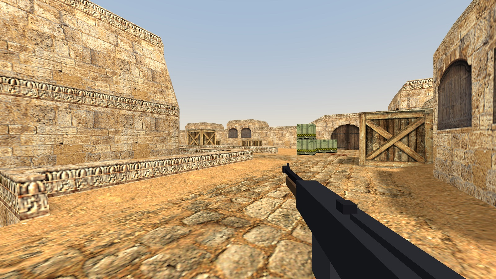
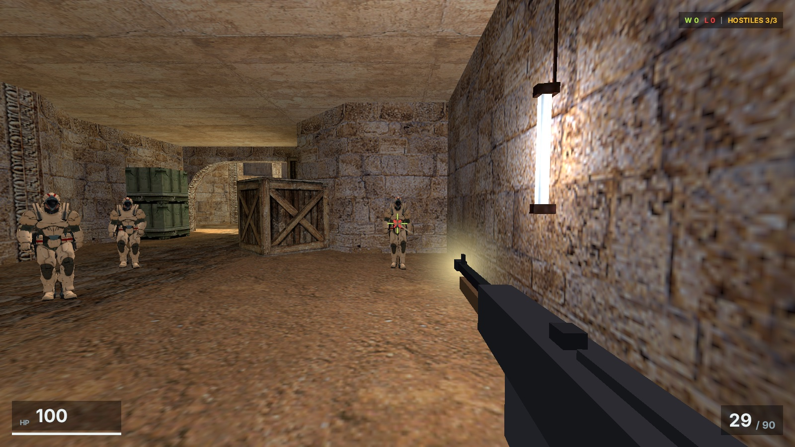
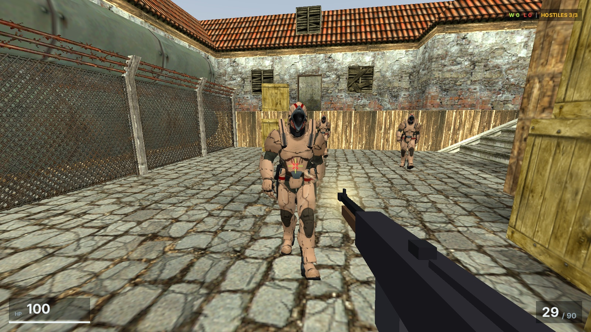
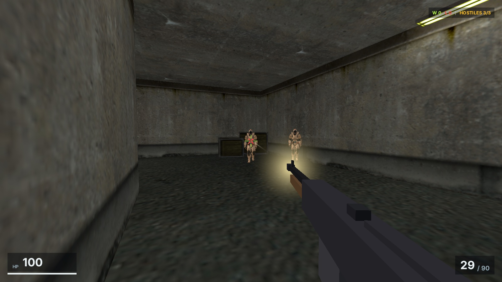
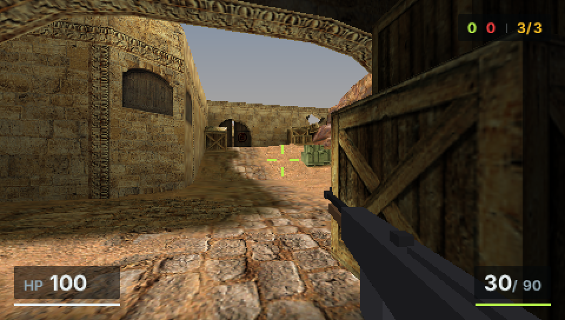
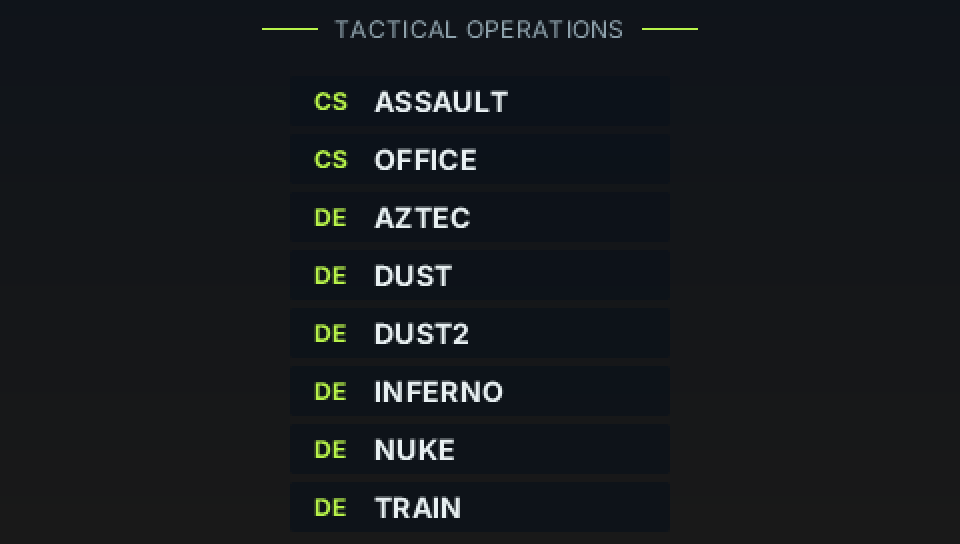
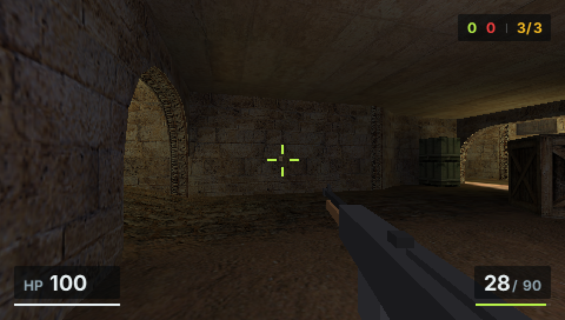

# OpenStrike

<p align="center">
  
</p>

<p align="center">
  
  
  
</p>

<p align="center">
  
</p>

<p align="center"><em>A CS-like FPS on classic BSP maps — Pocket3D worlds, a PocketJS JSX HUD, gameplay in TypeScript.<br/>
The same game runs on desktop (wgpu) and on a real 2004 Sony PSP (sceGu) at a locked 60 fps — bottom shot is the PSP.</em></p>

A single-player CS-like FPS built on the **Pocket runtime family**: a Rust
core (Pocket3D) simulates and renders; the *product* — round rules, weapon
tables, difficulty, and the entire HUD — is JavaScript running in an embedded
QuickJS guest. OpenStrike is the first specialized game runtime of
[PocketJS](https://github.com/pocket-stack/pocketjs); the architecture it
instantiates is documented in the engine repo's
[RUNTIMES.md](https://github.com/pocket-stack/pocketjs/blob/main/RUNTIMES.md).

```
crates/openstrike-core   the simulation — no_std Rust shared VERBATIM by both
                         targets (movement, bots, weapons, round state)
crates/openstrike        the desktop build
  ├─ pocket3d            wgpu renderer, BSP worlds, collision, skeletal anim
  ├─ pocket-mod          the QuickJS guest (one realm, one turn per tick)
  ├─ pocket-ui-wgpu      the `ui` surface — PocketJS, composited as the HUD
  └─ strike surface      this game's vocabulary (src/guest.rs)
crates/openstrike-psp    the PSP build: an EBOOT on pocket3d-gu (sceGu) and
                         the PocketJS PSP host — same surfaces, same bundle

game/                    the product bundle (JS/TSX) — runs on BOTH targets
  ├─ sdk.ts              `strike` SDK: state snapshots, events, commands
  ├─ rules.ts            the base game as the FIRST MOD: round flow, scoring,
  │                      weapon + bot tuning
  └─ hud.tsx             the HUD — a full PocketJS app (Solid + Tailwind)

vendor/pocketjs          the engine, pinned as a git submodule
```

Every tick: the core simulates, publishes a state snapshot + event batch to
the guest (`strike.__dispatch`), the HUD frame runs, and the guest's queued
commands (`setPhase`, `resetRound`, `configureWeapon`, …) apply back to the
core. Facts flow one way, intent flows the other, and the guest never blocks
the simulation. Change `game/rules.ts` and you have made a mod — the base
game grants itself no privileges a mod wouldn't have.

## Building

```sh
git clone --recursive https://github.com/pocket-stack/open-strike
cd open-strike
bun run setup      # installs the vendored framework deps + solid-js link
bun run build:ui   # game/openstrike.tsx -> dist/openstrike.{js,pak}
```

### Map data

Maps and textures are **not** in this repo (they are Valve-copyrighted game
data). Point the game at a directory containing them:

```
<maps-root>/
├── maps/de_dust2.bsp  (and friends)
└── support/*.wad      (cs_dust.wad, halflife.wad, ...)
```

Any GoldSrc-era (BSP v30) map works; the eight classic CS maps are the
tested set. `OPENSTRIKE_MAPS` can replace `--maps-dir` below.

### Play

```sh
cargo run --release -p openstrike -- --maps-dir ~/path/to/cs-maps
```

| Input | Action |
| --- | --- |
| Mouse | look |
| WASD | move (Shift = walk) |
| Space | jump |
| Left mouse | fire |
| R | reload |
| Esc | release/capture mouse |
| F3 | debug overlay |
| V | noclip fly (debug) |

Options: `--map de_inferno`, `--bots 5`, `--spawn-t`, `--auto-quit 5`.

Round rules (v0.1, see `game/rules.ts`): eliminate every bot to win; die and
you lose. Either way the round resets automatically and the score carries
over.

## Headless verification

Every acceptance criterion runs without a window — the renderer draws
offscreen, input is scripted, the RNG is seeded, and the round/lose scripts
boot the full QuickJS guest so the *shipped* rules and HUD are what gets
tested:

```sh
cargo run --release -p openstrike -- --maps-dir $MAPS --script walk   --screenshot out/walk
cargo run --release -p openstrike -- --maps-dir $MAPS --script model  --screenshot out/model
cargo run --release -p openstrike -- --maps-dir $MAPS --script combat --screenshot out/combat
cargo run --release -p openstrike -- --maps-dir $MAPS --script round  --screenshot out/round
cargo run --release -p openstrike -- --maps-dir $MAPS --script lose   --screenshot out/lose
```

- `walk` — spawn, run at 250 u/s, slide along walls without clipping, jump
  exactly ~45 units, and hold the viewmodel anti-jitter invariant (the gun
  must ride the interpolated camera, not the raw tick state).
- `model` — the soldier renders and its clips actually animate.
- `combat` — aim, fire, tracers/flash, a bot takes three body shots and dies.
- `round` — observe bot AI, engage, eliminate all, **win** (scored by the JS
  rules), and verify the automatic next round. Screenshots include the HUD.
- `lose` — stand still until the bots win; verify the loss + restart.

## Real PSP hardware

OpenStrike runs on an actual Sony PSP — same simulation, same JS rules, same
JSX HUD, rendered by the sceGu backend (`pocket3d-gu`). Not a stripped-down
demo: the identical `dist/openstrike.js` bundle that drives the desktop build
boots in QuickJS on the handheld. It ships as a proper EBOOT — branded XMB
icon and backdrop, a main menu that lists every cooked map, and SELECT to
return there mid-round.

<p align="center">
  
  
</p>

<p align="center"><em>Captured from the shipping EBOOT in PPSSPP's software renderer at native 480×272 — the same
deterministic backend the byte-exact e2e goldens run on.</em></p>

```sh
git submodule update --init          # pocketjs + rust-psp + quickjs-rs forks
bun scripts/psp.ts                   # bundle → cook every map → cargo psp EBOOT
bun scripts/psp.ts --package         # + assemble dist/PSP/GAME/OpenStrike (ms0 layout)
bun scripts/hw.ts --bench            # launch over PSPLINK; frame times stream back
bun scripts/e2e-psp.ts               # deterministic PPSSPP goldens (spawn/walk/fire)
```

Install: copy `dist/PSP/` to a Memory Stick root (or the emulator's memstick
dir) on a homebrew-enabled PSP; OpenStrike appears in the Game menu with its
icon. The build needs the PSP toolchain from the PocketJS ecosystem
(`pocket doctor`) plus the CS maps (`OPENSTRIKE_MAPS`).

Controls: analog stick moves, `△/✕/□/○` looks, `R` fires, `L` jumps, d-pad
down reloads, d-pad up walks, **SELECT** opens the return-to-menu dialog. In
the menu, d-pad selects a map and `○` deploys.

Measured on hardware (333 MHz, `--bench`, scripted dust2 tour): a locked
60 fps, GE under 30 µs — and combat is flat too (no per-shot hitch: the HUD
updates through the framework's imperative hot path, avoiding a reactive
flush per frame). Cooking bakes lightmaps into vertex colors, keeps WAD
textures as swizzled CLUT8 with full mip chains, and ships PVS so the renderer
draws only the visible leaves; each `.p3d` is consumed zero-copy, and maps
load on demand from `maps/` next to the EBOOT into one reused buffer.

## Modding, v0.1 shape

The `strike` surface currently speaks: state snapshots (`hp`, `ammo`,
`phase`, `aliveBots`, …), events (`hit`, `playerDamaged`, `playerDied`,
`roundReset`), and commands (`setPhase`, `resetRound`, `addWin`/`addLoss`,
`setBotCount`, `configureWeapon`, `configureBots`). The HUD has the whole
PocketJS `ui` surface. Both mount into one realm — a mod can restyle the
HUD and rewrite the rules in the same file.

Out of scope for v0.1: multiple weapons, buy phases, waypointed bot
navigation, networking, and a stable mod-distribution format. The surface
grows by appending, never by renumbering.

## Assets

- Bot character: see [assets/models/CREDITS.md](assets/models/CREDITS.md).
- Map/texture data (`.bsp`/`.wad`) is © Valve and must be provided from your
  own copy of the game.
