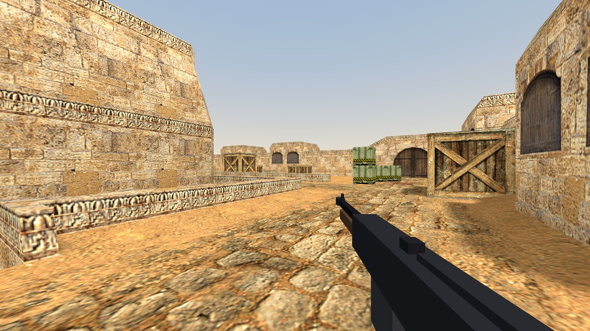
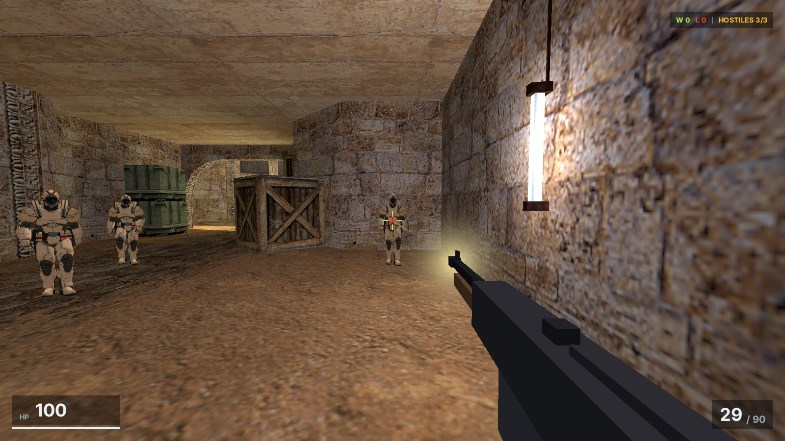
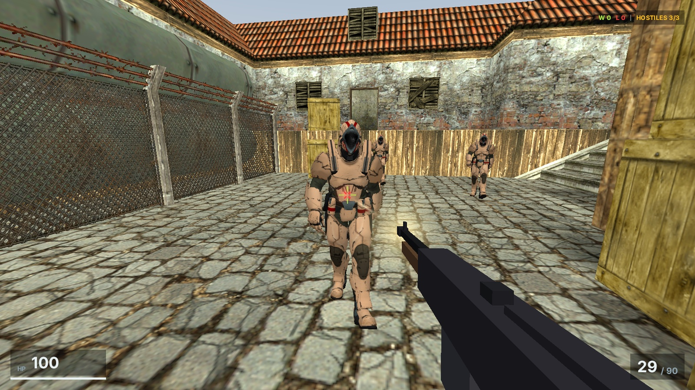
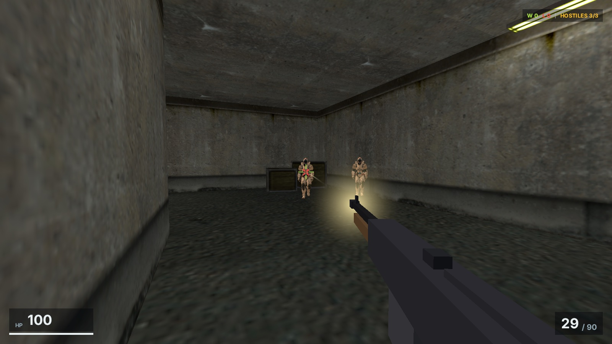
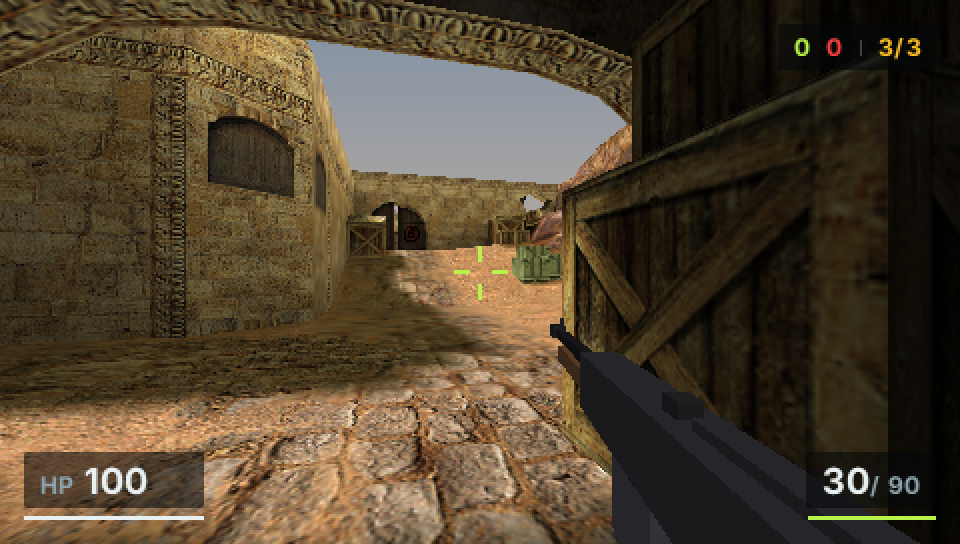
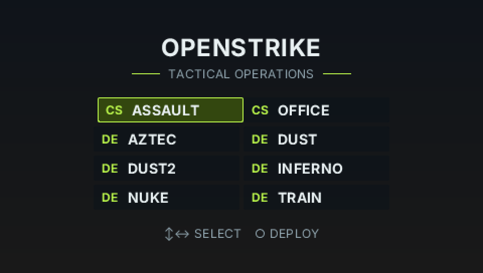
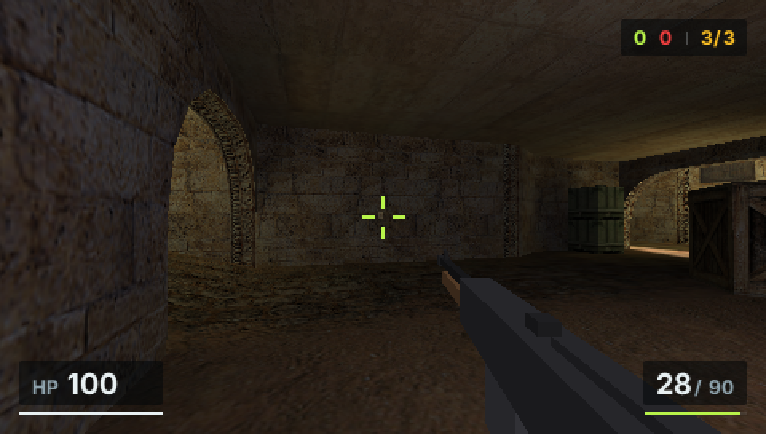

# OpenStrike

<p align="center">
  
</p>

<p align="center">
  
  
  
</p>

<p align="center">
  
</p>

<p align="center"><em>A CS-like FPS on classic BSP maps — Pocket3D worlds, a PocketJS JSX HUD, gameplay in TypeScript.<br/>
The full 3D game targets desktop (wgpu), PSP (sceGu), PS Vita
(vita2d/GXM), and Nokia E7 (OpenGL ES 2). The bottom shot is the real PSP
running at a locked 60 fps.</em></p>

A single-player CS-like FPS built on the **Pocket runtime family**: a Rust
core (Pocket3D) simulates and renders; the *product* — round rules, weapon
tables, difficulty, and the entire HUD — is JavaScript running in an embedded
QuickJS guest. OpenStrike is the first specialized game runtime of
[PocketJS](https://github.com/pocket-stack/pocketjs); the architecture it
instantiates is documented in the engine repo's
[RUNTIMES.md](https://github.com/pocket-stack/pocketjs/blob/main/RUNTIMES.md).

```
crates/openstrike-core   the simulation — portable Rust shared VERBATIM by all
                         targets (movement, bots, weapons, round state)
crates/openstrike        the desktop build
  ├─ pocket3d            wgpu renderer, BSP worlds, collision, skeletal anim
  ├─ pocket-mod          the QuickJS guest (one realm, one turn per tick)
  ├─ pocket-ui-wgpu      the `ui` surface — PocketJS, composited as the HUD
  └─ strike surface      this game's vocabulary (src/guest.rs)
crates/openstrike-psp    the PSP build: an EBOOT on pocket3d-gu (sceGu) and
                         the PocketJS PSP host — same surfaces, same bundle
crates/openstrike-vita   the PS Vita build: a native 960×544 VPK on
                         pocket3d-vita + PocketJS's vita2d/GXM host
crates/openstrike-symbian
                         the E7 app core: the shared simulation + Pocket3D
                         GLES2, statically linked into PocketJS's Qt host

game/                    the product bundle (JS/TSX) — runs on every target
  ├─ sdk.ts              `strike` SDK: state snapshots, events, commands
  ├─ rules.ts            the base game as the FIRST MOD: round flow, scoring,
  │                      weapon + bot tuning
  └─ hud.tsx             the HUD — a full PocketJS app (Solid + Tailwind)

vendor/pocketjs          the engine, pinned as a git submodule
```

Every tick: the core simulates, publishes a state snapshot + event batch to
the guest (`strike.__dispatch`), the HUD frame runs, and the guest's queued
commands (`setPhase`, `resetRound`, `configureWeapon`, …) apply back to the
core. Facts flow one way, intent flows the other, and the guest never blocks
the simulation. Change `game/rules.ts` and you have made a mod — the base
game grants itself no privileges a mod wouldn't have.

## Building

```sh
git clone --recursive https://github.com/pocket-stack/open-strike
cd open-strike
bun run setup      # installs the vendored framework deps + solid-js link
bun run bootstrap  # install the pinned PSP toolchain into the shared cache
bun run check:platforms
bun run build:ui   # resolve PSP -> dist/pocket/psp/openstrike.{js,pak}
bun scripts/build-ui.ts --target vita
```

PSP builds resolve the normalized SDK in a fixed order: `PSP_SDK`, then
`PSPDEV`, then Pocket's versioned shared cache at
`$XDG_CACHE_HOME/pocket-stack/psp/sdk/sdk-noabicalls-normalized-2026-06-19/mipsel-sony-psp`
(or the same path under `~/.cache`). Both SDK environment variables are then
exported to the build, so Rust and QuickJS cannot silently select different
toolchains. The vendored PocketJS manifest pins the organization-owned
`pocket-stack/pspdev`, `pocket-stack/rust-psp`, and
`pocket-stack/quickjs-rs` revisions used by every PSP build; no DreamCart or
personal-fork checkout is required.

[`pocket.json`](pocket.json) is the portable Pocket application contract. It
requires baked glyphs and buttons, and uses the left analog API when the
target provides it. PSP/Vita select its 480x272 fixed `integer-fit` viewport;
the Nokia E7 selects the same manifest's `display.viewport.live` enhancement
and 640x360-through-360x640 dynamic viewport. Pocket3D remains an extension
implemented by OpenStrike's custom native hosts rather than a private
manifest channel. Every target build validates its manifest, runs the
ordinary reachable TypeScript check, writes
`.pocket/<target>/plan.json`, and delegates compilation to `pocket compile`.
The public `@pocketjs/framework/manifest` helpers verify the build-plan
checksum, project stable `HostBuildInputs`, and generate Cargo's target, host
ABI and viewport environment. Target artifacts are isolated under
`dist/pocket/<target>` so concurrent PSP/Vita builds cannot overwrite one
another. At runtime PocketJS compares target and host ABI; the plan checksum
is build-time consistency data, not a runtime trust mechanism.

## Nokia E7: full 3D OpenStrike

The E7 build is the real FPS, not the former top-down substitute. Its
application-specific static core source-shares `openstrike-core`, installs the
native `strike` surface before the canonical `game/openstrike.tsx` bundle is
evaluated, loads the selected cooked map on demand, and renders it through
Pocket3D's OpenGL ES 2 backend. The depth-tested world, bots, weapon viewmodel,
muzzle effects, collision, round logic, and PocketJS JSX HUD all run in the
same app.

The Qt host owns QuickJS, the GL context, and presentation. The native
extension renders the 3D scene first; PocketJS composites the retained HUD
over it. At the E7 host's 30 Hz presentation rate the simulation advances two
fixed 60 Hz ticks per frame. Rotation updates the camera aspect and live UI
viewport without rebuilding the simulation, so an active match survives
landscape/portrait changes.

E7 keyboard controls:

| Key | Action |
| --- | --- |
| W / A / S / D | move |
| Arrow keys | look during play; select maps and dialog choices in menus |
| Enter | deploy the selected map or confirm the selected dialog choice |
| Enter or E | fire (Enter confirms the selected item while a menu is open) |
| R | reload |
| Space | jump |
| Shift | walk |
| Backspace or Home | open/close the return-to-menu dialog |

The local E7 build produces one SIS containing the runtime and all eight
locally supplied cooked maps: `cs_assault`, `cs_office`, `de_aztec`,
`de_dust`, `de_dust2`, `de_inferno`, `de_nuke`, and `de_train`. Maps are
installed as separate data files and loaded one at a time, so the 32 MiB
process heap never holds the complete map set or duplicates it through
QuickJS. Touch aiming is not implemented yet.

Map and WAD data remain user-supplied. They, the generated P3D files, and the
resulting map-bearing SIS must not be committed to this repository or
published as a release artifact. `OPENSTRIKE_MAPS` may point to a source tree
with `maps/*.bsp` and `support/*.wad`; otherwise the local default is
`~/Downloads/cs-maps-20260705-1836`. The build cooks and verifies the eight
maps into ignored `dist/maps/*.p3d`. A complete set of already cooked,
canonically verified P3D files is also a valid local build input when the
copyrighted BSP/WAD source tree is unavailable.

```sh
# Hermetic manifest/PAK/tooling tests: no Docker, map data, or device needed.
bun run test:symbian

# Cook/verify all eight local maps and validate the guest plus map catalogue.
OPENSTRIKE_MAPS=~/path/to/cs-maps bun run test:symbian-bundle

# Build the pinned native core and one independently installable, eight-map SIS.
OPENSTRIKE_MAPS=~/path/to/cs-maps bun run build:symbian
```

The pinned `vendor/pocketjs` checkout is authoritative.
`POCKETJS_ROOT=/path/to/pocketjs` (or `--pocketjs-root`) is available only for
guest-only compatibility checks. A native build rejects any checkout other
than `vendor/pocketjs`, because the Rust dependency graph and Qt packager must
use the same pinned ABI. The full command uses PocketJS's exact Symbian
nightly, 30 Hz host rate, custom target JSON, and
`build-std=core,alloc,compiler_builtins`, then passes the resulting static
library through the toolchain's explicit `--core-library` boundary. It writes
`dist/symbian/openstrike.sis`, validates the cooked map through Pocket3D's
canonical Rust reader, and revalidates the packaged JS/PAK against that exact
map; installation and visual acceptance still require a real E7.

### Map data

Maps and textures are **not** in this repo (they are Valve-copyrighted game
data). Point the game at a directory containing them:

```
<maps-root>/
├── maps/de_dust2.bsp  (and friends)
└── support/*.wad      (cs_dust.wad, halflife.wad, ...)
```

Any GoldSrc-era (BSP v30) map works; the eight classic CS maps are the
tested set. `OPENSTRIKE_MAPS` can replace `--maps-dir` below.

### Play

```sh
cargo run --release -p openstrike -- --maps-dir ~/path/to/cs-maps
```

| Input | Action |
| --- | --- |
| Mouse | look |
| WASD | move (Shift = walk) |
| Space | jump |
| Left mouse | fire |
| R | reload |
| Esc | release/capture mouse |
| F3 | debug overlay |
| V | noclip fly (debug) |

Options: `--map de_inferno`, `--bots 5`, `--spawn-t`, `--auto-quit 5`.

Round rules (v0.1, see `game/rules.ts`): eliminate every bot to win; die and
you lose. Either way the round resets automatically and the score carries
over.

## Headless verification

Every acceptance criterion runs without a window — the renderer draws
offscreen, input is scripted, the RNG is seeded, and the round/lose scripts
boot the full QuickJS guest so the *shipped* rules and HUD are what gets
tested:

```sh
cargo run --release -p openstrike -- --maps-dir $MAPS --script walk   --screenshot out/walk
cargo run --release -p openstrike -- --maps-dir $MAPS --script model  --screenshot out/model
cargo run --release -p openstrike -- --maps-dir $MAPS --script combat --screenshot out/combat
cargo run --release -p openstrike -- --maps-dir $MAPS --script round  --screenshot out/round
cargo run --release -p openstrike -- --maps-dir $MAPS --script lose   --screenshot out/lose
```

- `walk` — spawn, run at 250 u/s, slide along walls without clipping, jump
  exactly ~45 units, and hold the viewmodel anti-jitter invariant (the gun
  must ride the interpolated camera, not the raw tick state).
- `model` — the soldier renders and its clips actually animate.
- `combat` — aim, fire, tracers/flash, a bot takes three body shots and dies.
- `round` — observe bot AI, engage, eliminate all, **win** (scored by the JS
  rules), and verify the automatic next round. Screenshots include the HUD.
- `lose` — stand still until the bots win; verify the loss + restart.

## Real PSP hardware

OpenStrike runs on an actual Sony PSP — same simulation, same JS rules, same
JSX HUD, rendered by the sceGu backend (`pocket3d-gu`). Not a stripped-down
demo: the identical `dist/pocket/psp/openstrike.js` bundle that drives the
desktop build boots in QuickJS on the handheld. It ships as a proper EBOOT —
branded XMB icon and backdrop, a main menu that lists every cooked map, and
SELECT to return there mid-round.

<p align="center">
  
  
</p>

<p align="center"><em>Captured from the shipping EBOOT in PPSSPP's software renderer at native 480×272 — the same
deterministic backend the byte-exact e2e goldens run on.</em></p>

```sh
git submodule update --init          # pocket-stack/pocketjs + rust-psp + quickjs-rs
bun scripts/psp.ts                   # resolve PSP plan → bundle → maps → EBOOT
bun scripts/psp.ts --package         # + assemble dist/PSP/GAME/OpenStrike (ms0 layout)
bun scripts/hw.ts --bench            # launch over PSPLINK; frame times stream back
bun scripts/e2e-psp.ts               # deterministic PPSSPP goldens (spawn/walk/fire)
```

Install: copy `dist/PSP/` to a Memory Stick root (or the emulator's memstick
dir) on a homebrew-enabled PSP; OpenStrike appears in the Game menu with its
icon. The build needs the PSP toolchain from the PocketJS ecosystem
(`pocket doctor`) plus the CS maps (`OPENSTRIKE_MAPS`).

Controls: analog stick moves, `△/✕/□/○` looks, `R` fires, `L` jumps, d-pad
down reloads, d-pad up walks, **SELECT** opens the return-to-menu dialog. In
the menu, d-pad selects a map and `○` deploys.

Measured on hardware (333 MHz, `--bench`, scripted dust2 tour): a locked
60 fps, GE under 30 µs — and combat is flat too (no per-shot hitch: the HUD
updates through the framework's imperative hot path, avoiding a reactive
flush per frame). Cooking bakes lightmaps into vertex colors, keeps WAD
textures as swizzled CLUT8 with full mip chains, and ships PVS so the renderer
draws only the visible leaves; each `.p3d` is consumed zero-copy, and maps
load on demand from `maps/` next to the EBOOT into one reused buffer.

## PS Vita

The Vita target runs the same simulation, JavaScript rules and Solid JSX HUD
as desktop and PSP. Pocket3D renders at Vita's native 960×544, while the
PocketJS UI keeps its 480×272 logical layout and rasterizes at Vita's native
2× density. Text, curves and rounded corners therefore use the full 960×544
pixel grid instead of duplicating PSP pixels. There is no letterboxing or
crop. Touch is not implemented yet; both sticks, shoulders, d-pad, face
buttons and SELECT cover gameplay and menus.

```sh
export VITASDK="$HOME/vitasdk"
export PATH="$VITASDK/bin:$HOME/.cargo/bin:$PATH"

OPENSTRIKE_MAPS=~/path/to/cs-maps bun scripts/vita.ts --release # resolved Vita plan → VPK
bun scripts/e2e-vita.ts
```

The VPK is written to `dist/vita/OpenStrike.vpk`. PocketJS's shared Vita
packager combines OpenStrike's branded 128×128 icon and cooked maps with the
framework's black 840×500 background, 280×158 startup image, and LiveArea
template. The Vita3K golden driver uses an isolated VitaFS, scripted dual-stick
input, a guest completion marker, byte-exact 960×544 HUD captures, and native
Pocket3D scene-stat assertions.
See [`crates/openstrike-vita/README.md`](crates/openstrike-vita/README.md) for
the pinned toolchain, controls and emulator-capture details.

## Modding, v0.1 shape

The `strike` surface currently speaks: state snapshots (`hp`, `ammo`,
`phase`, `aliveBots`, …), events (`hit`, `playerDamaged`, `playerDied`,
`roundReset`), and commands (`setPhase`, `resetRound`, `addWin`/`addLoss`,
`setBotCount`, `configureWeapon`, `configureBots`). The HUD has the whole
PocketJS `ui` surface. Both mount into one realm — a mod can restyle the
HUD and rewrite the rules in the same file.

Out of scope for v0.1: multiple weapons, buy phases, waypointed bot
navigation, networking, and a stable mod-distribution format. The surface
grows by appending, never by renumbering.

## Assets

- Bot character: see [assets/models/CREDITS.md](assets/models/CREDITS.md).
- Map/texture data (`.bsp`/`.wad`) is © Valve and must be provided from your
  own copy of the game.
