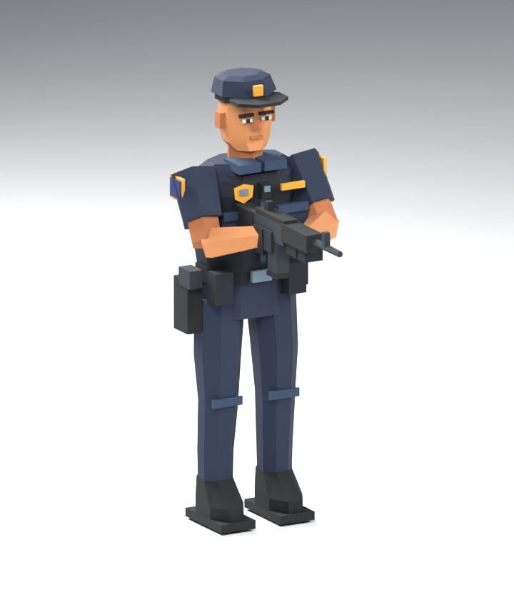

# OpenStrike patrol officer

Original low-poly US patrol-police character, authored in Blender for this
repository under its MIT license. Navy uniform, peaked cap, shield badges,
body camera, duty belt, radio, holster and two-handed service carbine. No
third-party character, rig, texture or animation is used.



`officer.blend` is the editable source with weighted armature and seven named
actions. `build.py` reproduces it, its packed-atlas `officer.glb`, the handheld
`officer.opch`, the studio `preview.png` and the measured `receipt.json`:

```sh
/Applications/Blender.app/Contents/MacOS/Blender --background --factory-startup \
  --python-exit-code 1 --python assets/characters/police/build.py
cargo run --locked -p openstrike -- --script character --size 480x272 \
  --screenshot out/character
bun scripts/character-psp.ts
```

The desktop preview needs no BSP/WAD assets. PSP capture uses the existing
local `dist/maps` cooked maps, or `OPENSTRIKE_COOKED_MAPS`. Those maps and
map-bearing EBOOT packages remain local/ignored.

## Runtime contract and budget

- 1,390 triangles, 847 unique handheld vertices, 17 bones, one opaque 64×64
  palette material. Desktop glTF splits normals/UVs into 2,634 vertices.
- Actions: Idle, Walk, Run, Fire, Reload, Hit, Death. Hosts resolve glTF names;
  simulation never depends on the exporter’s alphabetical clip indices.
- Handhelds consume 16-bit quantized poses. The 97 baked frames occupy
  504,818 bytes, below 512 KiB. Per-action rates are in `receipt.json`: 24 Hz
  Run/Death, 16 Hz Walk, 12 Hz Fire/Hit, 8 Hz Reload and 2 Hz Idle. All are
  interpolated at presentation rate; there is no on-device armature solver,
  glTF parser, texture allocation or per-frame character heap allocation.
- PSP uses GE hardware morphing, u16 indexed triangles, one draw per visible
  actor and camera-frustum culling. Adjacent pairs of 12-byte packed vertices
  occupy one immutable 1,971,816-byte cache shared by every actor, plus two
  8,340-byte index tables. A held pose selects the first member of each pair
  with doubled indices, avoiding unnecessary two-frame morphing. The buffers
  are built and cache-flushed once; moving poses select a pair and two weights.
  No character vertex upload or CPU interpolation is
  needed per frame. The buffers remain alive while the GE reads them. Signed
  16-bit GE coordinates normalize by 32768, so the model scale restores 128
  game units per normalized unit (OPCH has 256 steps per game unit).
- Vita/Symbian reuse the same sampled poses and retain their existing triangle
  submission APIs; their reusable conversion buffers expand the index stream.
- The 60 Hz Blender comparison measures each clip, including between bake
  keys, and rejects position error above 2 game units. The actor is 70 units
  tall. The receipt includes support-sole height for locomotion.

Bot shots, including misses, start Fire and originate from the carried
carbine muzzle. Each bot reloads its 12-shot magazine for two seconds and
cannot shoot during that interval. Hit and Death interrupt presentation.

Walk/Run use offline two-link IK for the planted foot, knee bend, swing and
heel/toe roll. Playback follows distance travelled using the authored stance
travel. The 1.25-second Death action contains recoil, knee collapse, body
fall, relaxed arms/carbine and the final settle; the host applies only world
placement and yaw. Bone rotations use continuous quaternion keys to avoid
Euler flips during the fall. Runtime checks also verify loop closure, a low
and grounded final corpse, and equivalence of CPU and GE pose sampling.

## PSP acceptance

```sh
# Ordinary playable build, menu and local eight-map package.
bun scripts/psp.ts -r --cooked-maps dist/maps --package

# Real gameplay timing, including simulation, with an 18 MiB heap cap.
POCKETJS_ARENA_BYTES=18874368 OPENSTRIKE_COOKED_MAPS=dist/maps \
  bun scripts/hw.ts -r --bench --daemon

# Render stress: one, three, then six actors; 30 seconds per count.
POCKETJS_ARENA_BYTES=18874368 OPENSTRIKE_COOKED_MAPS=dist/maps \
  bun scripts/hw.ts -r --character-bench --daemon
```

The stress mode is a separate feature that stages poses in the BSP scene and
omits gameplay simulation. Its records carry `actor_probe: true`; it must be
paired with ordinary gameplay measurements. The bench now records actor
count/cost, observed frame cadence, p95/p99 frame interval, late frames and
arena high-water. `avg_tris` is world geometry; actor triangles are reported
separately. `gpu_us` remains the wait at synchronization, not total GPU time.

The target is a 16.67 ms frame budget at 333 MHz. Physical PSP acceptance
requires sustained gameplay plus the 1/3/6-actor sweep, stable arena use,
visual inspection and fresh movement/fire input. PPSSPP captures prove
rendering and liveness; emulator timings cannot establish hardware smoothness.
Capture builds exit after their requested frames: rebuild the normal or bench
binary before loading on hardware.

Physical PSP validation on 2026-09-07 is recorded in
`out/hardware-20260907/stress-final.jsonl`: 10,800 frames across two complete
1/3/6-actor sweeps, including all seven actions. Average cadence was
59.22/59.02/58.91 fps; maximum window p95 was 16.709 ms. The 18 MiB heap cap
retained 3,708,000 bytes of unused tail after a 15,166,368-byte high-water.
This proves the tested device under that cap, not a separate PSP-1000 run.
There are still transition/JS long frames: worst window p99 was 53.309 ms.

Before GE morphing, the six-actor sweep was around 30 fps and actor CPU work
was about 8 ms; it is now about 0.41 ms. The raw before/after logs, physical
framebuffer captures, desktop motion previews and regression logs remain in
`out/hardware-20260907`; `out/character-psp` contains the nine PPSSPP capture
checks. See [the hardware report](../../../docs/PSP_CHARACTER_ACCEPTANCE.md)
for gameplay results and the remaining acceptance boundaries. This work stays
on character PR #17, separate from the already merged upstream PR #16.
